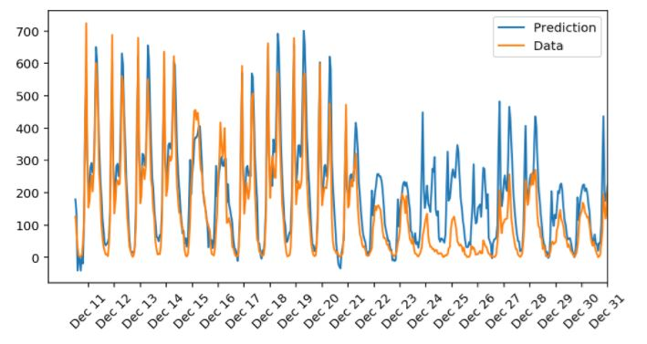
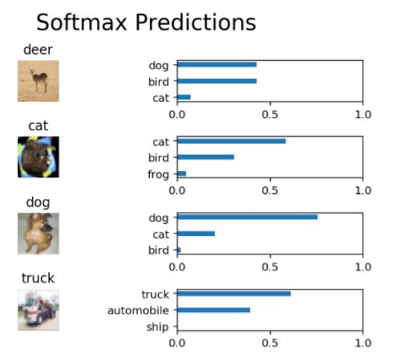
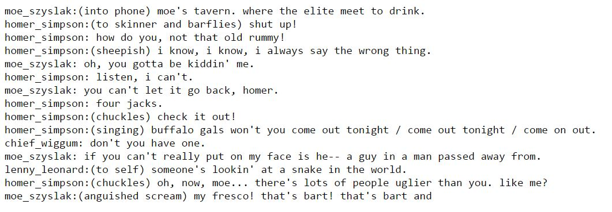
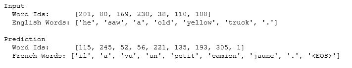

# Udacity- Deep Learning Foundation Nanodegree

 <a href="https://www.udacity.com/course/deep-learning-nanodegree-foundation--nd101">
The Nanodegree's website</a> 

A 17 weeks course that covers convolutional neural networks, recurrent neural networks, reinforcement learning, and other applications of deep learning.

### Projects
- [x] [Project 1: Predict Number of Bikeshare Users](https://github.com/Sally-Ng/DLND-Predict_Number_of_Bikeshare_Users)
- [x] [Project 2: Image Classification](https://github.com/Sally-Ng/DLND-Image_Classification)
- [x] [Project 3: Generate TV scripts](https://github.com/Sally-Ng/DLND-Generate_TV_scripts)
- [x] [Project 4: Translate a Language](https://github.com/Sally-Ng/DAND-Translate_a_Language)
- [ ] Project 5: Generate Faces

### Syllabus
Week 1: Introduction to Deep Learning  
Week 2: Model Evaluation and Validation  
Week 3: Graph Computations  
Week 4: Intro to TensorFlow  
Week 5: Deep Neural Networks  
Week 6: Convolutional Networks  
Week 7: Recurrent Neural Networks  
Week 8: Word Embeddings  
Week 9: Using TensorBoard  
Week 10: Text Generation  
Week 11: Sequence to Sequence Generation  
Week 12: Transfer Learning  
Week 13: Reinforcement Learning  
Week 14: Autoencoders  
Week 15: Generative Adversarial Networks (GAN)  
Week 16: Image Generation  
Week 17: One-shot Learning 
 
 
[Project 1: Predict Number of Bikeshare Users](https://github.com/Sally-Ng/DLND-Predict_Number_of_Bikeshare_Users) 
Language: Python (pandas, NumPy, Matplotlib)   
Built and trained a Neural Network to predict the number of bikeshare users on a given day.
 

  

 

[Project 2: Image Classification](https://github.com/Sally-Ng/DLND-Image_Classification)  
Language: Python (NumPy, TensorFlow, scikit-learn)  
Built and trained a Convolutional Neural Network to classify images from the CIFAR-10 dataset.
 

  

 

[Project 3: Generate TV scripts](https://github.com/Sally-Ng/DLND-Generate_TV_scripts)  
Language: Python(NumPy, TensorFlow)  
Built and trained a Recurrent Neural Network to generate scripts for a TV show.
 

  

 

[Project 4: Translate a Language](https://github.com/Sally-Ng/DAND-Translate_a_Language)  
Language: Python (NumPy, TensorFlow)  
Built and trained a Recurrent Neural Network and a Sequence to Sequence model
on a dataset of English and French sentences that can translate new sentences from English to French.
 

  

